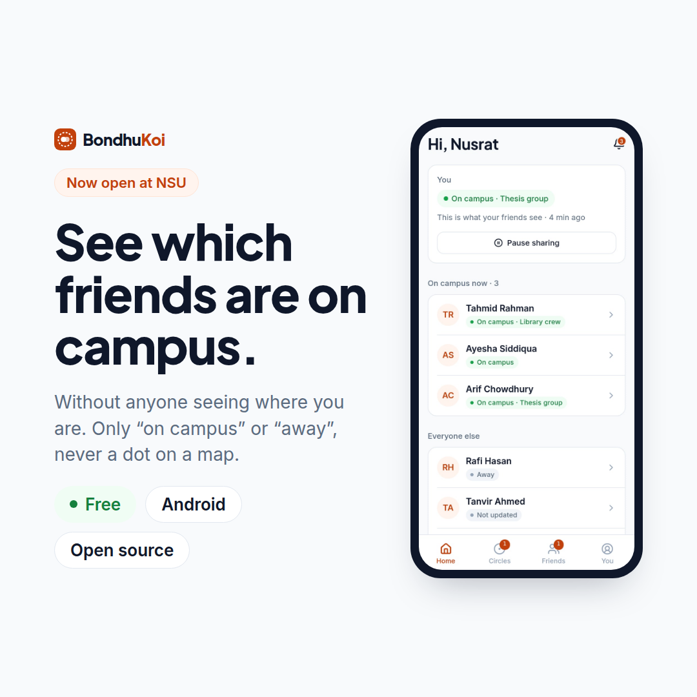
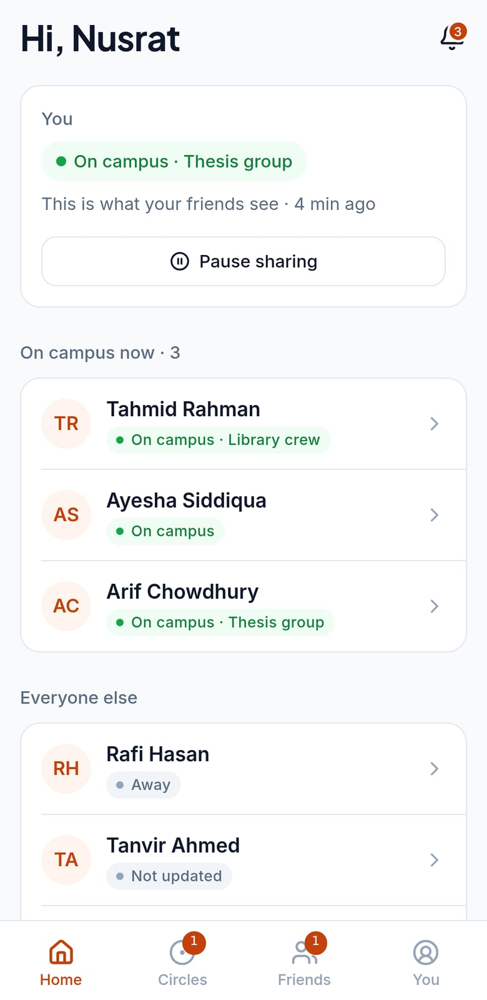
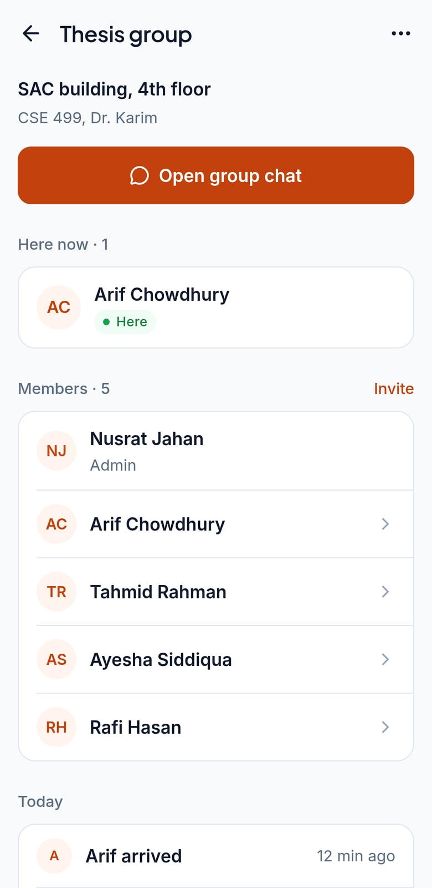
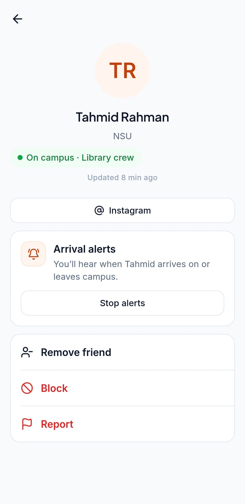
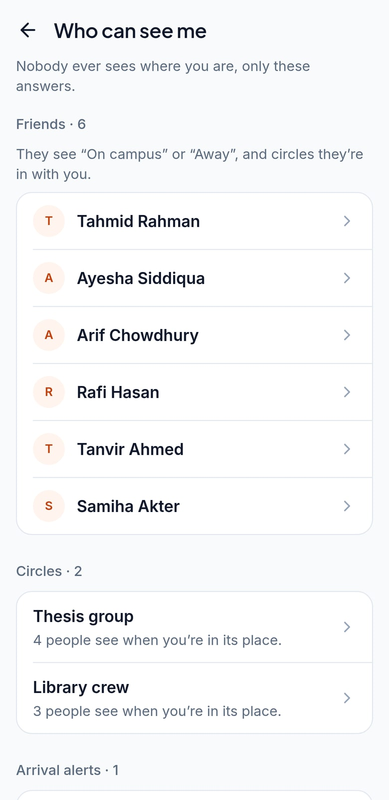

<div align="center">

# BondhuKoi

**See which friends are on campus, without anyone seeing where you are.**

Only "on campus" or "away", never a dot on a map · circles for the places you meet ·
quiet at night · students only · open source

React Native (Expo) · Fastify · Supabase (Postgres + PostGIS) · Google Cloud Run



</div>

---

## Why BondhuKoi

Every day between classes, students send "who's on campus?" to five group chats.
Location-sharing apps could answer it, but they show exactly where you are, all day, to
friends and to the company running them.

BondhuKoi answers only the question that matters. Your phone watches the edge of your
campus (and your circles' places); when you cross one, it sends a single reading. The
server answers "inside or not?", stores **only that answer**, and throws the reading away.
Friends you accepted see "On campus" or "Away". Nobody, including BondhuKoi's admins, can
see where you are or were.

## What it does

| | |
|---|---|
| **Home** | Your status first ("On campus · Thesis group", pause in one tap), then which friends are on campus now |
| **Circles** | A small group with a place: draw your thesis lab or the library on the map (tap the corners, tap the first corner to close). The map becomes the circle's cover picture, and members see who's there right now |
| **Friends** | Add by 8-letter code, QR or name (your university only). Requests need a yes |
| **Arrival alerts** | A friend can ask to be told when you arrive on campus. You decide, and either of you can stop it |
| **Privacy** | Quiet hours (6 PM–6 AM by default), per-circle detection, campus sharing, 24-hour history, "Who can see me", block and report |
| **Students only** | Sign-up needs a university email (checked in the database), optionally an invite code |
| **Admin console** | Sign-ups, users, reports, universities and campus boundaries, invites, settings, rate limits, audit log. Two-factor required, and no way to see anyone's location |

| Home | Circle | Friend | Who can see me |
|---|---|---|---|
|  |  |  |  |

## Repository

| Path | What |
|---|---|
| [`frontend/BondhuKoiApp/`](frontend/BondhuKoiApp) | The Android app (Expo, Expo Router). Design rules: [`docs/design.md`](docs/design.md) |
| [`backend/`](backend) | The API (Fastify, `pg`, Supabase Auth tokens). 80 tests: `npm test` |
| [`supabase/`](supabase) | The database as code: migrations (schema, row-level security, sign-up rules, clean-up jobs) |
| [`admin/`](admin) | The admin console (React, antd, Tailwind) |
| [`site/`](site) | Website: landing page, privacy policy, terms, account deletion |
| [`e2e/`](e2e) | Maestro phone flows and a k6 load test |
| [`docs/`](docs) | Plan, deploy, release, testing, backups, security review, marketing kit |

## Run it locally

```bash
npx supabase start                         # Postgres + PostGIS, Auth, Storage in Docker
cd backend && cp .env.example .env && npm install && npm run dev
cd frontend/BondhuKoiApp && cp .env.example .env && npm install && npx expo run:android
cd admin && cp .env.example .env && npm install && npm run dev
```

Design preview without any server: `EXPO_PUBLIC_DEMO=1 npx expo start --web` in the app
(sample students; `EXPO_PUBLIC_DEMO=signed-out` for the welcome screens).

## Tests

```bash
cd backend && npm test                     # API, database rules, privacy, fuzz (Docker)
cd frontend/BondhuKoiApp && npm test       # app units and colour contrast
```

CI runs lint, tests, a bundle check of the app, the admin build, `npm audit` and gitleaks
on every push. See [`docs/testing.md`](docs/testing.md) for end-to-end, load and real-phone tests.

## Hosting (free tiers)

Supabase Free (database, auth, storage) · Google Cloud Run (API) · Cloudflare Pages (admin
and website) · Expo push. Expected cost: **$0 a month** plus $25 once for Google Play.
Step by step: [`docs/deploy.md`](docs/deploy.md) and [`docs/release.md`](docs/release.md).

## Security

Every route checks ownership and is covered by a fuzz test; the database refuses the app's
public key; admins can't see locations; nothing about location is logged. Read the
[security review](docs/security-review.md) and [threat model](docs/security/threat-model.md).
Found a problem? See [SECURITY.md](SECURITY.md).

## Status

Revamp in progress: [`docs/REVAMP_PLAN.md`](docs/REVAMP_PLAN.md) has the plan, what's done
and the decision log.

## License

[ISC](LICENSE)
